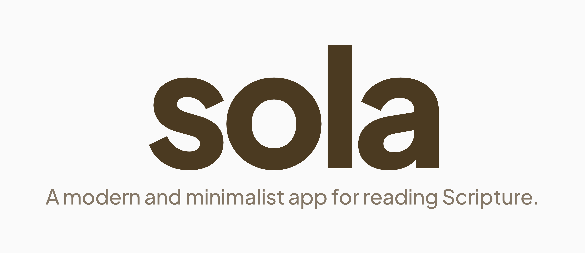
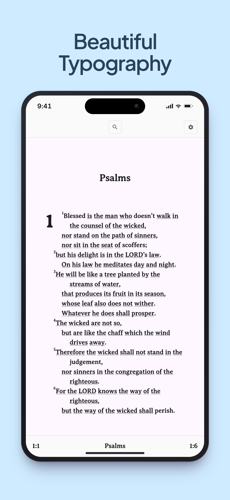
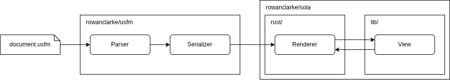

## Motivation

**There are many Bible reading apps already, why do we need another?**

The most popular Bible reading apps are closed-source, and littered with distractions and advetisements. They
lazily dump scrolling text on a screen and then try to sell you something that you didn't ask for. Sola treats
Scripture like a real book and renders each page with a clean typography that makes you want to keep reading.
Stay tuned for more quality features.

## Screenshots

  
  
  
  
  

## Goals

- Support every translation ever written
  - Collect, clean, and self-host every open-domain translation
  - Request and host every proprietary translation
- Support every platform including iOS, Android, and Web
- Language-specific intelligent searching
- Language-specific ancient Greek/Hebrew dictionaries

## Non-Goals

- Note-taking
- Highlighting

## Contribute

Thanks for your interest in contributing! This project is a **Flutter** app
with native **Rust** code (compiled via [cargokit](https://github.com/irondash/cargokit))
targeting **Android**. To save you from installing the entire toolchain by
hand, the full development environment ships as a Docker container — Flutter,
the Android SDK, and a Rust toolchain are all baked in.

You only need these on your host machine:
 
- [`docker`](https://docs.docker.com/get-docker/) and Docker Compose
- [`git`](https://git-scm.com/)

### Pipeline

### Issues

If you find a bug or would like to request a feature, firstly, **ensure you are
in the correct repository as per the pipeline above**. Then submit an issue using one of the templates provided
and give as much detailed information as possible.

### Pull Requests

Target the `master` branch. Ensure no breaking changes. Do not bump version as the project is still in pre-release.
